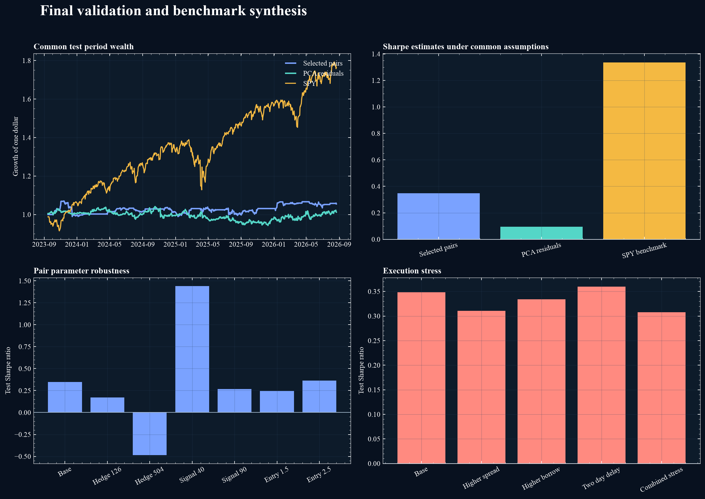
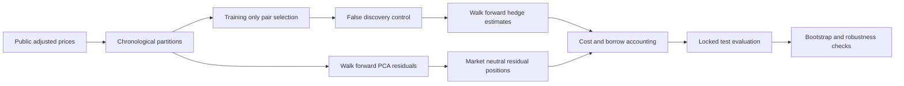
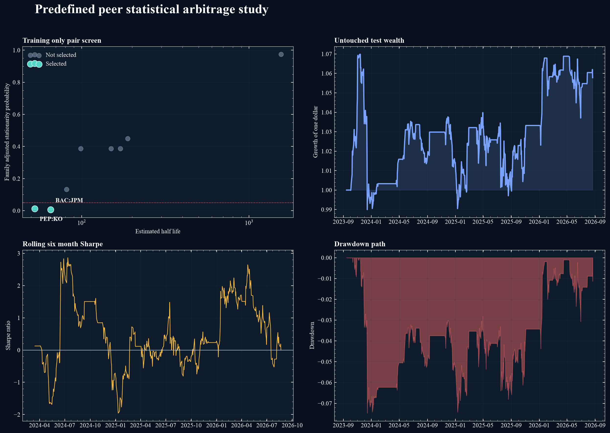
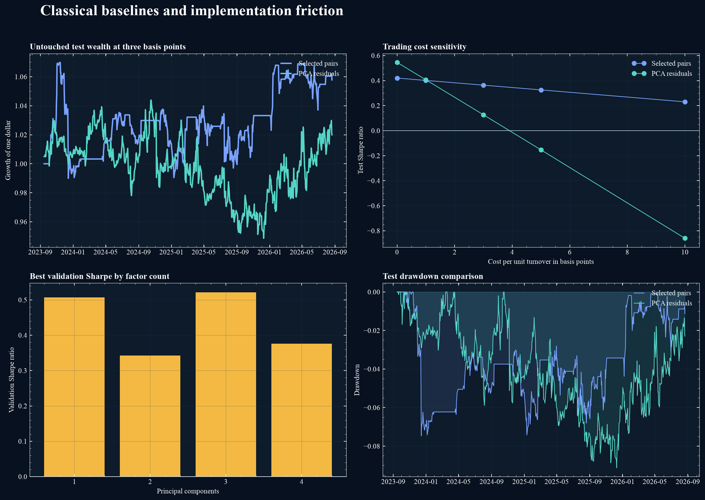
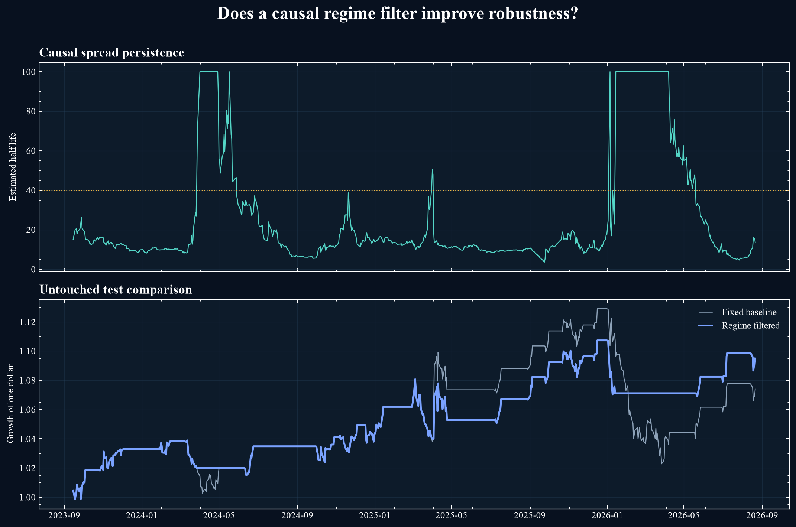

# Quant Research Portfolio

Rigorous, reproducible studies of statistical arbitrage, predictive uncertainty, and market microstructure.

[](https://colab.research.google.com/github/am610/quant-research-portfolio/blob/main/notebooks/01_pair_trading_baseline.ipynb)
[](https://colab.research.google.com/github/am610/quant-research-portfolio/blob/main/notebooks/02_regime_filter.ipynb)
[](https://colab.research.google.com/github/am610/quant-research-portfolio/blob/main/notebooks/03_peer_universe.ipynb)
[](https://colab.research.google.com/github/am610/quant-research-portfolio/blob/main/notebooks/04_pca_cost_sensitivity.ipynb)
[](https://colab.research.google.com/github/am610/quant-research-portfolio/blob/main/notebooks/05_final_validation.ipynb)

## Executive summary

This project asks whether classical and machine learning inspired statistical arbitrage signals survive selection controls, chronological testing, uncertainty analysis, and realistic implementation friction.

The answer is cautious. Selected peer pairs produce a positive test estimate with low market beta and survive the specified execution stresses, but their uncertainty interval includes zero and their performance depends on modeling choices. A principal component residual strategy looks competitive before costs but loses most of its value because of high turnover. A passive SPY investment strongly outperforms during the test window, while carrying materially different market exposure.



| Model | Annual return | Volatility | Sharpe | Maximum drawdown | Market beta |
| --- | ---: | ---: | ---: | ---: | ---: |
| Selected peer pairs | 1.86 percent | 5.75 percent | 0.35 | 7.51 percent | 0.02 |
| PCA residuals | 0.43 percent | 7.60 percent | 0.09 | 9.38 percent | 0.02 |
| SPY benchmark | 21.47 percent | 15.44 percent | 1.34 | 18.76 percent | 1.00 |

These figures use three basis points of turnover cost, 50 basis points of annual short borrow cost, and a one day execution delay for the arbitrage models.

## Research architecture



## Main study



The expanded experiment begins with twelve liquid stocks in five economically predefined peer groups. Pair relationships are estimated using training data only, all stationarity tests receive a family level false discovery correction, and hedge ratios are updated from trailing observations.

Only BAC with JPM and PEP with KO pass the five percent corrected threshold. Their combined untouched test result has a 1.94 percent annual return, 5.75 percent annual volatility, a 0.36 Sharpe estimate, and a 7.47 percent maximum drawdown. The 95 percent bootstrap Sharpe interval spans negative 0.63 to 1.48, so the evidence remains inconclusive.

## Classical model and cost comparison



The walk forward principal component residual strategy appears stronger before costs, with a test Sharpe estimate of 0.55 compared with 0.42 for selected pairs. Its advantage disappears quickly because it trades more aggressively. At three basis points its Sharpe estimate falls to 0.13, and at five basis points it becomes negative. The selected pair portfolio remains positive through ten basis points.

This comparison demonstrates why predictive structure and tradable value are not equivalent.


## First result

The first locked baseline uses XLE and XOP adjusted daily prices. The hedge relation is estimated only on the training period. A fixed causal rolling rule is evaluated after three basis points of turnover cost.

The untouched test period produced a 1.34 percent annual return, 5.02 percent annual volatility, a Sharpe ratio of 0.29, and a maximum drawdown of 9.40 percent. A stationary block bootstrap gave a wide 95 percent Sharpe interval from negative 0.96 to 1.46. Validation performance was negative.

This is not evidence of a dependable trading strategy. It is an intentionally transparent benchmark and motivates the next research question: can regime information and calibrated uncertainty distinguish temporary mean reversion from structural breakdown?

## Regime result



A causal filter based on rolling spread persistence and innovation volatility was selected using validation data only. On the untouched test period it increased the Sharpe estimate from 0.49 to 0.73 and reduced maximum drawdown from 9.40 percent to 3.78 percent.

The 95 percent bootstrap Sharpe interval still crosses zero, from negative 0.22 to 1.79. The result is therefore encouraging but not conclusive. This uncertainty motivates the calibrated prediction study rather than a profitability claim.

## Research program

### Study 1: Regime aware statistical arbitrage

This study asks whether machine learning can identify more persistent mean reverting portfolios than classical methods after transaction costs, selection effects, and market regime changes are considered.

Planned comparisons include cointegration, principal component residuals, moving band portfolios, and temporal neural models. Evaluation will use chronological splits, realistic costs, block bootstrap uncertainty, and stress tests across market conditions.

### Study 2: Uncertainty aware return prediction

This study asks whether calibrated predictive uncertainty improves trading decisions during distribution shift. Linear models, gradient boosted trees, temporal neural models, and ensemble uncertainty estimates will be compared using both statistical and economic metrics.

### Study 3: Limit order book forecasting

This study asks when accurate short horizon forecasts remain tradable after fees, spread, fill probability, latency assumptions, and adverse selection are included.

## Portfolio principles

1. Every complex model must beat a simple baseline.
2. Every evaluation must preserve time order.
3. Every reported strategy must include realistic trading frictions.
4. Every key result must include uncertainty or stability evidence.
5. Negative results and failure cases are part of the research output.

## Planned public artifacts

1. Reproducible Python package and configuration files
2. Colab notebooks for compact demonstrations
3. Research reports with methods, results, and limitations
4. Interactive visual summaries for recruiters
5. Automated tests for data leakage and accounting logic

## Status

Project 1 is complete. It includes data validation, cost and borrow accounting, execution delays, risk metrics, benchmark comparison, bootstrap uncertainty, pair selection, false discovery correction, walk forward estimation, regime filtering, principal component residuals, exposure diagnostics, parameter robustness, and time boundary robustness. Five executed Colab notebooks document the research progression.

## Reproduce the first study

```bash
python -m pip install -e .
PYTHONPATH=src python scripts/run_pair_baseline.py
```

The script downloads adjusted daily observations from Yahoo Finance and records the retrieval cutoff. Generated data files are excluded from version control.
