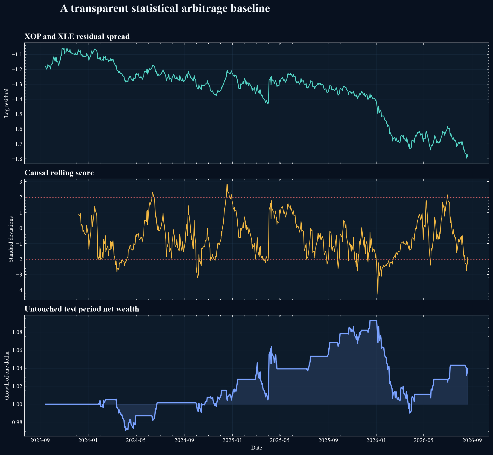

# Quant Research Portfolio

Rigorous, reproducible studies of statistical arbitrage, predictive uncertainty, and market microstructure.



## First result

The first locked baseline uses XLE and XOP adjusted daily prices. The hedge relation is estimated only on the training period. A fixed causal rolling rule is evaluated after three basis points of turnover cost.

The untouched test period produced a 1.34 percent annual return, 5.02 percent annual volatility, a Sharpe ratio of 0.29, and a maximum drawdown of 9.40 percent. A stationary block bootstrap gave a wide 95 percent Sharpe interval from negative 0.96 to 1.46. Validation performance was negative.

This is not evidence of a dependable trading strategy. It is an intentionally transparent benchmark and motivates the next research question: can regime information and calibrated uncertainty distinguish temporary mean reversion from structural breakdown?

## Research program

### Study 1: Regime aware statistical arbitrage

This study asks whether machine learning can identify more persistent mean reverting portfolios than classical methods after transaction costs, selection effects, and market regime changes are considered.

Planned comparisons include cointegration, principal component residuals, moving band portfolios, and temporal neural models. Evaluation will use chronological splits, realistic costs, block bootstrap uncertainty, and stress tests across market conditions.

### Study 2: Uncertainty aware return prediction

This study asks whether calibrated predictive uncertainty improves trading decisions during distribution shift. Linear models, gradient boosted trees, temporal neural models, and ensemble uncertainty estimates will be compared using both statistical and economic metrics.

### Study 3: Limit order book forecasting

This study asks when accurate short horizon forecasts remain tradable after fees, spread, fill probability, latency assumptions, and adverse selection are included.

## Portfolio principles

1. Every complex model must beat a simple baseline.
2. Every evaluation must preserve time order.
3. Every reported strategy must include realistic trading frictions.
4. Every key result must include uncertainty or stability evidence.
5. Negative results and failure cases are part of the research output.

## Planned public artifacts

1. Reproducible Python package and configuration files
2. Colab notebooks for compact demonstrations
3. Research reports with methods, results, and limitations
4. Interactive visual summaries for recruiters
5. Automated tests for data leakage and accounting logic

## Status

The portfolio architecture, data validation, cost accounting, risk metrics, bootstrap uncertainty, and classical pair baseline are implemented and tested. The first real market result and Colab ready demonstration are available. Regime modeling is the next milestone.

## Reproduce the first study

```bash
python -m pip install -e .
PYTHONPATH=src python scripts/run_pair_baseline.py
```

The script downloads adjusted daily observations from Yahoo Finance and records the retrieval cutoff. Generated data files are excluded from version control.
